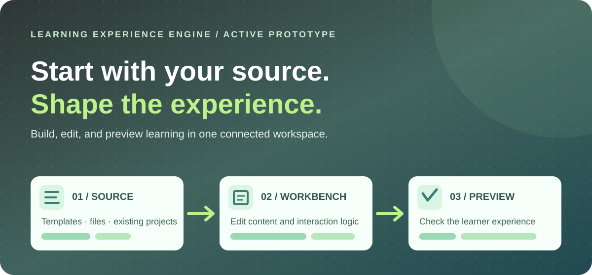

# Learning Experience Engine

**An active project for turning published learning content into editable, reviewable experiences.** The public page introduces the project. The full Workbench runs locally, where source imports, change review, and learner previews can be developed without exposing private material.

**[View the public project page →](https://reeder-design.github.io/learning-experience-engine/)** &nbsp;·&nbsp; **[See how it fits the portfolio system →](https://reeder-design.github.io/id-portfolio-system/projects/github-workflow/)**

## Public page · local Workbench

**Public:** The [project landing page](https://reeder-design.github.io/learning-experience-engine/) explains the concept and current direction. The [portfolio's GitHub workflow guide](https://reeder-design.github.io/id-portfolio-system/projects/github-workflow/) shows a portfolio-safe illustration of the local tools.

**Local and password-protected:** The full Learning Workbench is used on my computer for source files, AI-assisted change proposals, review, and learner preview. It is not a public web app. Published Rise and Storyline exports, private project files, and AI credentials stay outside this public repository.

For implementation details and the current build status, see the [repository guide](docs/repository-guide.md).
